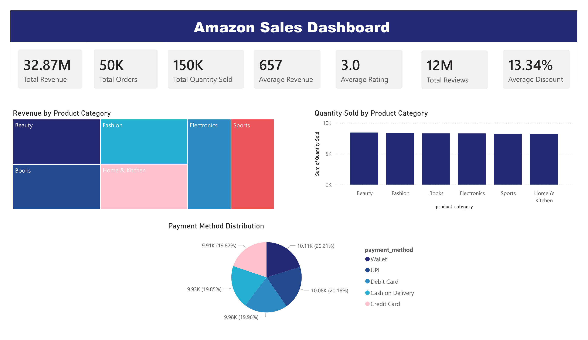
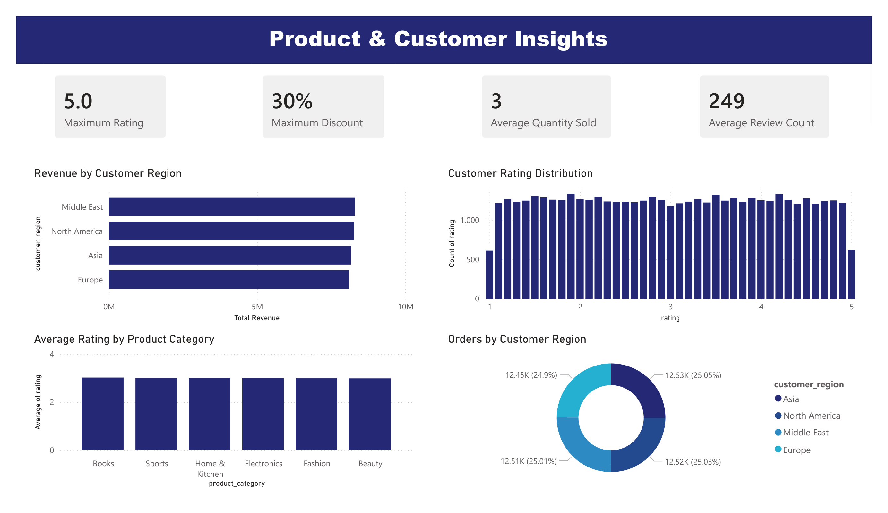
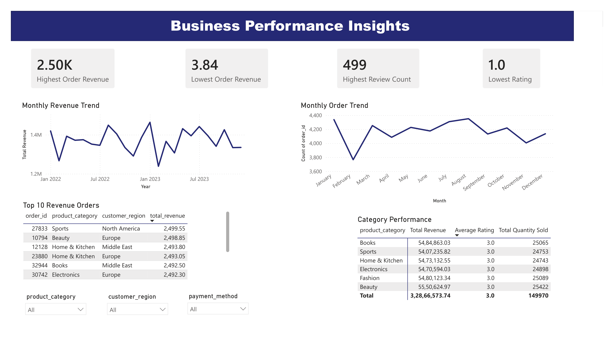

# 📊 Amazon E-commerce Sales Analytics Dashboard

An end-to-end Data Analytics project that analyzes Amazon e-commerce sales data using **Python, MySQL, and Power BI**. The project focuses on cleaning raw sales data, performing exploratory data analysis (EDA), executing SQL-based business queries, and building an interactive Power BI dashboard to generate actionable business insights.

---

## 📌 Project Objectives

- Clean and preprocess raw Amazon sales data.
- Perform exploratory data analysis (EDA) using Python.
- Analyze sales performance using SQL queries.
- Build an interactive Power BI dashboard.
- Extract meaningful business insights to support decision-making.

---

## 🛠️ Tech Stack

- **Python**
  - Pandas
  - NumPy
  - Matplotlib
  - Seaborn

- **Database**
  - MySQL

- **Visualization**
  - Power BI

- **IDE**
  - Visual Studio Code

---

## 📂 Project Structure

```
Amazon-Ecommerce-Sales-Analytics/
│
├── Dataset/
│   ├── amazon_sales_dataset.csv
│   └── amazon_sales_clean.csv
│
├── Python/
│   ├── data_cleaning.py
│   ├── check_dataset.py
│   ├── revenue_by_category.py
│   ├── products_by_category.py
│   ├── payment_method_analysis.py
│   ├── rating_distribution.py
│   ├── revenue_by_region.py
│   ├── discount_distribution.py
│   ├── revenue_boxplot.py
│   ├── correlation_heatmap.py
│   └── import_to_mysql.py
│
├── SQL/
│   └── amazon_sales_queries.sql
│
├── PowerBI/
│   └── Amazon_Sales_Dashboard.pbix
│
├── Screenshots/
│   ├── dashboard_page1.png
│   ├── dashboard_page2.png
│   └── dashboard_page3.png
│
├── requirements.txt
└── README.md
```

---

## 🧹 Data Cleaning

The dataset was cleaned using Python by performing:

- Handling missing values
- Removing duplicate records
- Checking data types
- Converting date columns
- Creating total revenue column
- Exporting the cleaned dataset

---

## 📈 Exploratory Data Analysis (EDA)

The following analyses were performed using Python:

- Revenue by Product Category
- Quantity Sold by Product Category
- Payment Method Distribution
- Customer Rating Distribution
- Revenue by Customer Region
- Discount Distribution
- Revenue Boxplot
- Correlation Heatmap

---

## 🗄️ SQL Analysis

Business insights were generated using MySQL with queries such as:

- Total Revenue
- Total Orders
- Average Rating
- Highest Revenue Orders
- Revenue by Category
- Revenue by Region
- Average Discount
- Highest Rated Categories
- Payment Method Analysis
- Top Revenue Products
- Review Analysis
- Sales Summary

A total of **15 SQL queries** were used for analysis.

---

# 📊 Power BI Dashboard

The dashboard consists of **3 interactive pages**.

## 📄 Page 1 – Amazon Sales Dashboard

Features:

- Total Revenue
- Total Orders
- Total Quantity Sold
- Average Revenue
- Average Rating
- Total Reviews
- Average Discount
- Revenue by Product Category
- Quantity Sold by Product Category
- Payment Method Distribution

---

## 📄 Page 2 – Product & Customer Insights

Features:

- Maximum Rating
- Maximum Discount
- Average Quantity Sold
- Average Review Count
- Revenue by Customer Region
- Customer Rating Distribution
- Average Rating by Product Category
- Orders by Customer Region

---

## 📄 Page 3 – Business Insights

Features:

- Highest Order Revenue
- Lowest Order Revenue
- Highest Review Count
- Lowest Rating
- Monthly Revenue Trend
- Monthly Order Trend
- Top 10 Revenue Orders
- Category Performance Summary
- Interactive Filters

---

## 📊 Key Business Insights

- Electronics and Fashion generated high revenue.
- Customer ratings remained consistent across categories.
- Revenue showed monthly fluctuations throughout the year.
- Customer regions contributed almost equally to total sales.
- Payment methods were evenly distributed among customers.
- Product categories performed similarly in terms of customer ratings.

---

## 📸 Dashboard Preview

### 📄 Page 1 – Amazon Sales Dashboard



---

### 📄 Page 2 – Product & Customer Insights



---

### 📄 Page 3 – Business Insights



---

## 🚀 Future Improvements

- Predict future sales using Machine Learning.
- Build a Streamlit dashboard.
- Connect Power BI directly to MySQL.
- Create automated ETL pipelines.
- Add real-time sales monitoring.

---

## 📚 Skills Demonstrated

- Data Cleaning
- Data Preprocessing
- Exploratory Data Analysis
- Data Visualization
- SQL
- Power BI
- Dashboard Design
- Business Analytics
- Data Storytelling

---

## 👨‍💻 Author

**Sarthak Mandal**
